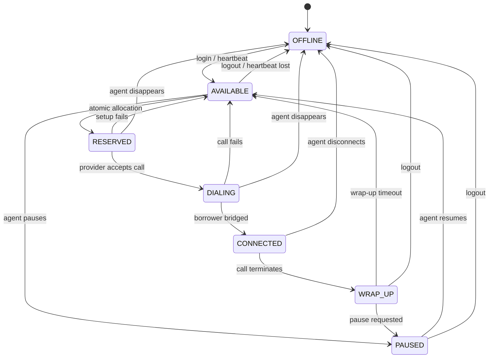

# Agent State Machine

## Reservation rule

Only `AVAILABLE` can be atomically claimed by the allocator. The update sets a reservation ID and expiry while holding a row lock. Other workers use `SKIP LOCKED`, so they immediately choose another agent instead of waiting on or duplicating the reservation.

The calls table adds a second line of defence with a partial unique index that permits one active call per `agent_id`.

## Heartbeats and disappearing agents

The prototype exposes controlled state transitions and records `last_seen_at`. The simulation forces a 40% capacity drop. Predictive pacing falls back immediately; no new predictive calls are approved during the unsafe snapshot.

If an agent disappears before an answer, progressive setup can be cancelled or another available agent can be claimed. If all capacity disappears after a borrower answers, the call is marked `ABANDONED`, a campaign safety incident is incremented, and future pacing becomes more conservative.
