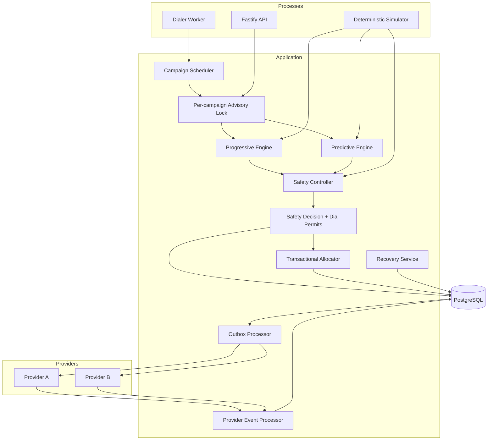

# Architecture

## Objectives

The system optimizes agent utilization subject to safety and correctness constraints. The architecture prioritizes the evaluation order in the assignment: system design, concurrency, predictive pacing, safety, failure handling, and only then presentation.

## Components



## Decision flow

1. A scheduler captures one campaign snapshot.
2. The configured pacing engine produces a proposal and explanation.
3. The Safety Controller recomputes limits independently.
4. A safety decision and a finite set of expiring permits are recorded.
5. The allocator consumes permits and claims agents/borrowers in PostgreSQL transactions.
6. The same transaction writes a provider command to the outbox.
7. A leased worker sends the command using a stable idempotency key.
8. Provider events are inserted once and folded through the call state machine.

## Concurrency invariants

### One active call per agent

Progressive allocation uses `FOR UPDATE SKIP LOCKED` to claim an `AVAILABLE` row. PostgreSQL also has a partial unique index on active calls by `agent_id`.

### One active call per borrower

Borrowers are selected and updated in the same transaction as call creation. A partial unique index prevents more than one non-terminal call per borrower.

### One call per safety permit

The permit update is conditional on `status = 'ISSUED'` and a future expiry. The calls table also has a unique foreign key to `permit_id`.

### One capacity decision at a time per campaign

Every runner obtains a PostgreSQL advisory lock derived from the campaign ID. This avoids duplicate predictive decisions across workers. Outstanding issued permits are included in the next snapshot, covering a worker crash between permit issuance and allocation.

### Database versus cache

PostgreSQL wins. No cache participates in reservations or capacity accounting. A future cache would be a disposable projection only.

## Predictive calculation

The proposal is intentionally explainable:

```text
future capacity = available agents + agents expected free by the answer horizon
target answers = floor(future capacity * target utilization)
existing expected answers = in-flight exposure * recent mean answer rate
new calls = ceil((target answers - existing expected answers) / answer rate)
```

The answer-rate estimate uses a small prior so a new campaign does not treat a tiny sample as certainty.

The Safety Controller does not trust the mean. It uses the upper answer-rate estimate plus a Hoeffding concentration bound and accepts the largest batch whose upper answer count fits within usable projected capacity.

## Safety checks

Hard rejection:

- Stale provider telemetry
- Provider unhealthy
- At least three consecutive provider failures

Progressive fallback:

- Insufficient recent samples
- Provider error rate above the predictive limit
- Excessive provider latency
- Sudden agent-capacity drop

Predictive clamping:

- Fifteen percent projected-agent headroom
- Maximum calls per decision
- Existing ringing/reserved calls
- Unconsumed permits
- Answers already waiting
- Conservative upper answer bound

The concentration bound uses a one-in-a-million risk budget per decision. A campaign evaluates
hundreds of decisions, so a superficially reasonable 1% per-tick value compounds into poor run-level
behaviour. The chosen reserve and risk budget are regression-tested across deterministic seeds; they
remain deployment parameters that must be recalibrated with production traffic.

## Reliability patterns

### Transactional outbox

Agent, borrower, call, permit, and provider-command state commit together. Provider I/O occurs later, outside the transaction.

### At-least-once delivery with idempotent effects

Outbox commands may be retried, but the provider receives the same idempotency key. Incoming events have a unique `(provider, provider_event_id)` constraint.

### Reservation and work leases

Dial permits, agent/borrower reservations, and outbox claims expire. The recovery worker expires permits, releases completed wrap-up agents, and resets abandoned worker leases.

### Monotonic call state

Provider events can skip intermediate states, but terminal states are absorbing. Invalid regressions are recorded as ignored instead of mutating the call.

## Scaling analysis

The first bottlenecks are expected to be:

1. The per-campaign decision lock for a very large single campaign.
2. PostgreSQL scans and row-lock contention on hot agent/borrower queues.
3. Provider calls-per-second limits.
4. Provider-event write volume and indexes.

The next architecture would partition campaigns and borrowers, maintain indexed ready queues, and grant bounded capacity leases to campaign shards. The outbox could feed a broker when database polling becomes measurable. Safety capacity must remain strongly controlled; replacing the database with eventually consistent counters would weaken the central guarantee.

## Known limitations

- Mock-provider idempotency state is in memory; a real adapter must use provider-supported keys or provider reconciliation APIs.
- Connected-call duration forecasting is deliberately simple.
- The statistical risk bound is conservative but cannot prove zero abandonment under predictive over-dialing.
- The prototype has no authentication, multi-tenancy, or personally identifiable information controls.
- Automatic failover between providers is not attempted after an ambiguous timeout because doing so can create duplicate borrower calls.
