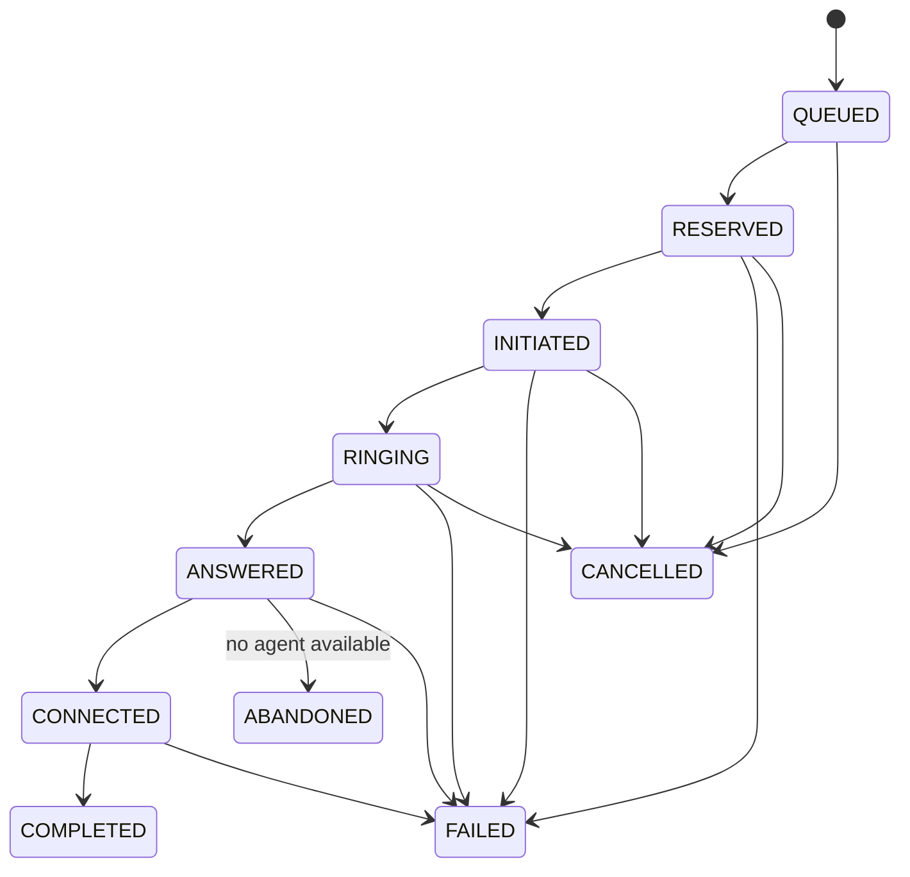

# Call State Machine

Providers are allowed to skip intermediate delivery events. For example, `INITIATED -> ANSWERED` and `INITIATED -> COMPLETED` are valid because external systems do not guarantee that every webhook arrives.

The terminal states are:

- `COMPLETED`
- `FAILED`
- `CANCELLED`
- `ABANDONED`

They are absorbing. A later `RINGING` or `ANSWERED` event is stored for audit but produces no call-state change.

## Duplicate events

The inbox has a unique `(provider, provider_event_id)` constraint. The first event performs the transition; later deliveries return `DUPLICATE`.

## Out-of-order events

The event worker locks the call row and checks the domain transition table. Forward jumps can be accepted; regressions are recorded as `IGNORED_OUT_OF_ORDER` or `IGNORED_TERMINAL`.

## Crash after ANSWERED

Event insertion, agent allocation, call transition, and related agent/borrower changes share one database transaction. A crash before commit leaves the event unprocessed for retry. A crash after commit leaves the completed state durable. No in-memory worker state is required to reconstruct the outcome.
